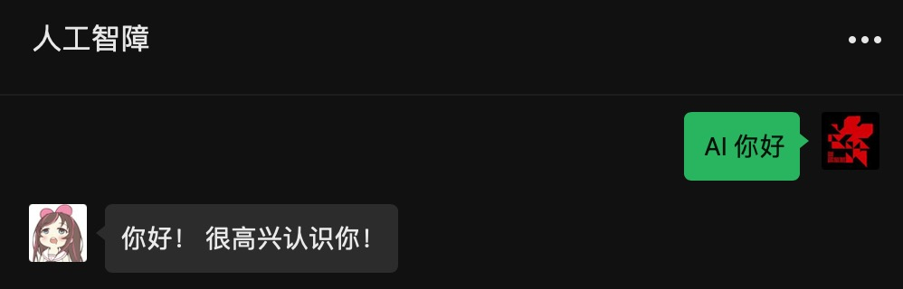

[](https://wechaty.js.org)

# wechaty-puppet-padlocal-gpt3

Use wechaty-puppet-padlocal chat with gpt3

## Example



## Use

### Get your OpenAI API keys for `ChatGPT`

- `openaiApiKey` can be generated in the [**API Keys Page** in your OpenAI account](https://beta.openai.com/account/api-keys)
- `openaiOrganizationID` is optional, which can be found in the [**Settings Page** in your Open AI account](https://beta.openai.com/account/org-settings)

---

### Configure Environment Variables

You can copy the template `config.yaml.example` into a new file `config.yaml`, and paste the configurations:

```yaml
openaiApiKey: "<your_openai_api_key>"
openaiOrganizationID: "<your_organization_id>"
chatgptTriggerKeyword: "<your_keyword>"
padLocalToken: "<your pad_local_token>"
```

Or you can export the environment variables listed in `.env.sample` to your system, which is a more encouraged method to keep your `OpenAI API Key` safe:

```bash
export OPENAI_API_KEY="sk-XXXXXXXXXXXXXXXXXXXXXXXXXXXXXX"
export OPENAI_ORGANIZATION_KEY="org-XXXXXXXXXXXXXXX"
export CHATGPT_TRIGGER_KEYWORD="Hi bot:"
export PAD_LOCAL_TOKEN="adsfasdfasdfasdfas"
```

**Please note:**

- `chatgptTriggerKeyword` is the keyword which can trigger auto-reply:
  - In private chat, the message **starts with** it will trigger auto-reply
  - In group chat, the message **starts with** `@Name <keyword>` will trigger auto-reply (Here `@Name ` means "@ the bot" in the group chat)
- `chatgptTriggerKeyword` can be **empty string**, which means:
  - In private chat, **every messages** will trigger auto-reply
  - In group chat, only **"@ the bot"** will trigger auto-reply
- `padLocalToken` means token for login with wechat:
  - Get token from [Padlocal](http://pad-local.com/#/)，get 7 day free try
  - Remove the `puppet_padlocal_` prefix

### Make it run

First:

```
npm install
```

Then:

```
npm run dev
```

### Login your WeChat

Once you deploy the bot successfully, just follow the `terminal` or `Logs` in Docker container prompt carefully:

0. Please use the mainland China cell phone number registered WeChat
1. Scan the QR Code with mobile WeChat
2. Click "Log in" in phone to allow desktop login (where our bot stays)
3. Wait a few seconds and start chatting!

🤖 **Enjoy your powerful chat bot!** 🤖


## Acknowledgement & Features

### Base

This project is implemented based on:

- [https://github.com/fuergaosi233/wechat-chatgpt](https://github.com/fuergaosi233/wechat-chatgpt)
- [https://github.com/kx-Huang/ChatGPT-on-WeChat](https://github.com/kx-Huang/ChatGPT-on-WeChat)
- [https://github.com/TankNee/chatgpt-wechaty](https://github.com/TankNee/chatgpt-wechaty)

But more stable and robust connection to `GPT3` and `Wechat`.

### Any Fancy Advanced Settings?

#### Config `ChatGPT` Models

You can change whatever `ChatGPT` Models you like to handle task at different capability & time-consumption trade-off. (e.g. model with better capability costs more time to respond)

Currently, we use the latest `text-davinci-003` model, which is:

> Most capable GPT-3 model. Can do any task the other models can do, often with higher quality, longer output and better instruction-following. Also supports inserting completions within text.

Also, for the same model, we can configure dozens of parameter. (e.g. answer randomness, maximum word limit...)

You can configure all of them in `src/chatgpt.js`:

```typescript
const ChatGPTModelConfig = {
  // this model field is required
  model: "text-davinci-003",
  // add your ChatGPT model parameters below
  temperature: 0.9,
  max_tokens: 2000,
};
```

For more details, please refer to [OpenAI Models Doc](https://beta.openai.com/docs/models/overview).

---

#### Config `ChatGPT` Features

You can change whatever `ChatGPT` features you like to handle different types of tasks. (e.g. complete text, edit text, generate image...)

Currently, we use `createCompletion()` to generate or manipulate text for daily usage, which:

> Creates a completion for the provided prompt and parameters

You can configure in `src/chatgpt.js`:

```typescript
const response = await this.OpenAI.createCompletion({
  ...ChatGPTModelConfig,
  prompt: inputMessage,
});
```

Of course you can ask how to edit text in current mode, but the outcome may fall short of expectations.

For more details, please refer to [OpenAI API Doc](https://beta.openai.com/docs/api-reference/introduction).

---

#### Config Auto Reply in Error

When `ChatGPT` encounters some errors (e.g. over-crowded traffic, no authorization, ...), the chat bot will auto-reply the pre-configured message.

You can change it in `src/chatgpt.js`:

```typescript
const chatgptErrorMessage = "机器人摆烂了，请稍后再试～";
```

---

#### Add Customized Task Handler

You can add your own task handlers to expand the ability of this chat bot!

Currently, add task handler in `src/main.ts`:

```typescript
// e.g. if a message starts with "Hello", the bot sends "World!"
if (message.text().startsWith("Hello")) {
  await message.say("World!");
  return;
}
```

Of course, stuffing all handlers in `main` function is really a **BAD** habit in coding. As a result, we will fix this in future updates to do logic separation.

## License

wechaty-puppet-padlocal-gpt3 is available under the ISC license. See the LICENSE file for more info.
